# Rapport mini-projet Terraform #

De Aurélien Daix

Lien GitHub : <https://github.com/GacruxM4/terraform_mini-projet.git>

---

## Création du module `ec2` ##

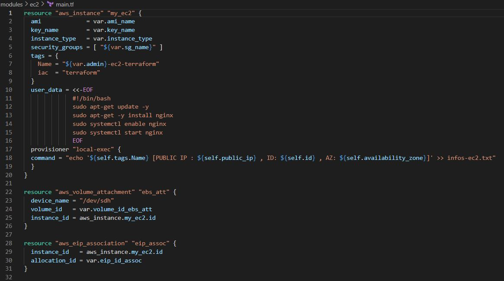
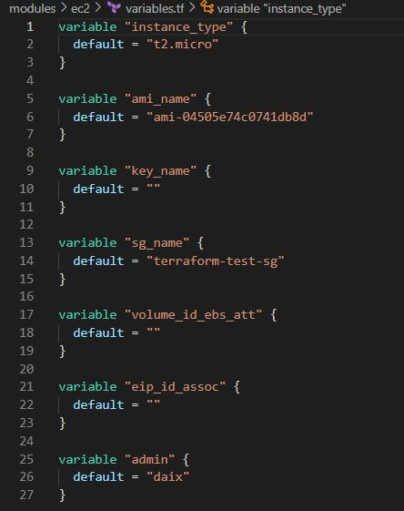

## Création du module `ebs` ##

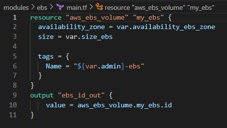
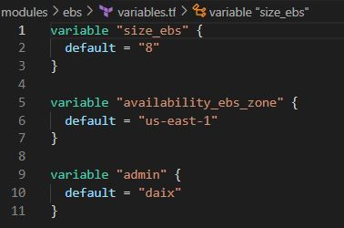

## Création du module `ip_pulic` ##

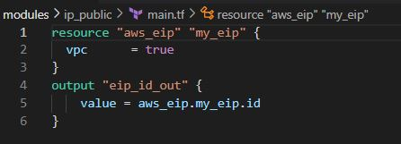

## Création du module `security_group` ##

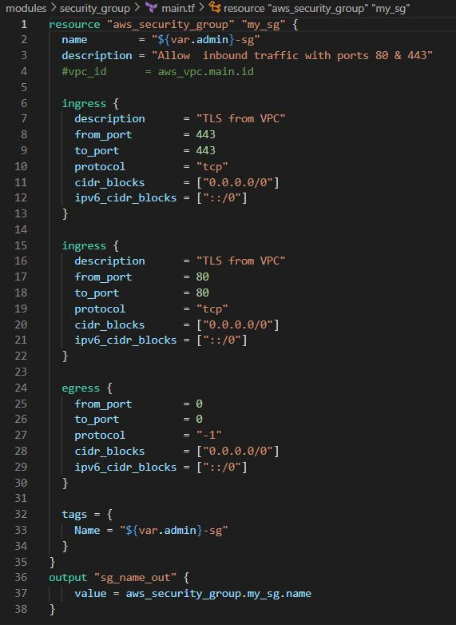
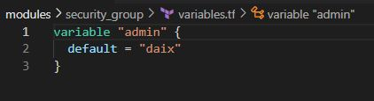

## Création de l'app utilisant les modules ##

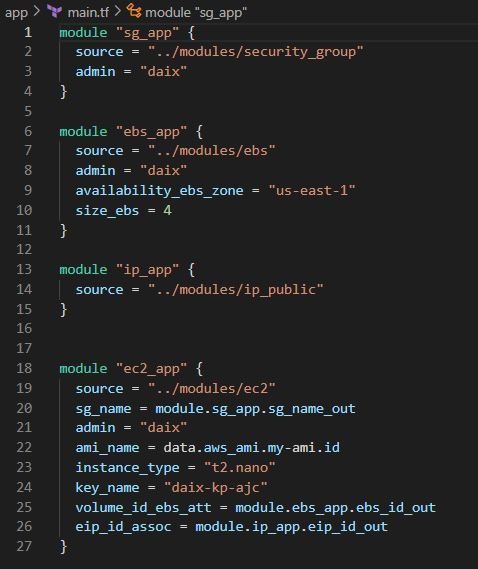
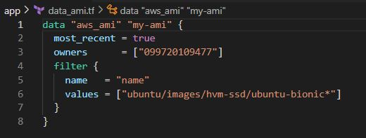
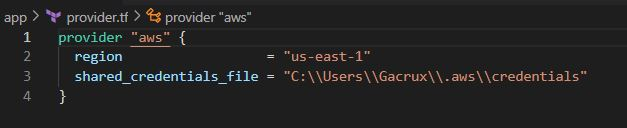

## Déploiement de l'instance et installation de nginx ##

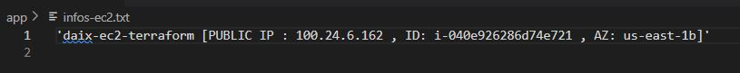
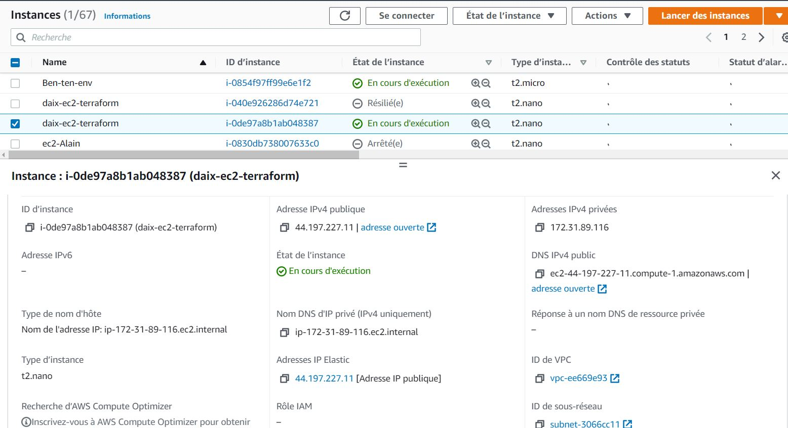
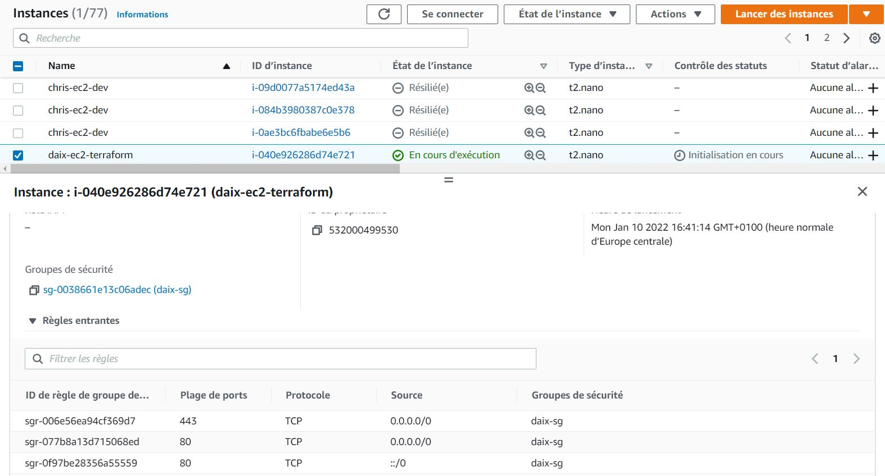
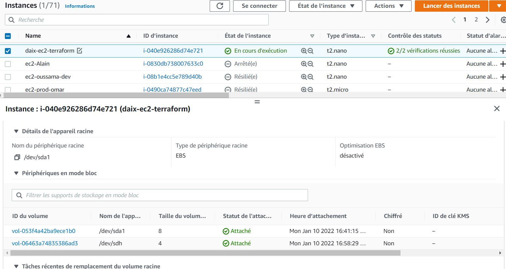
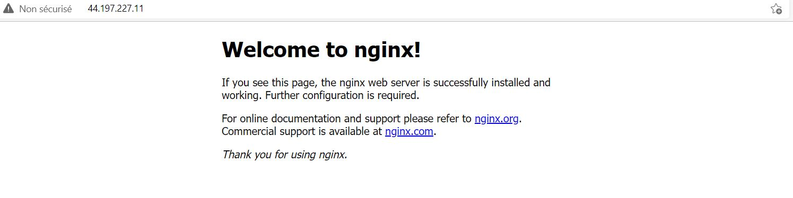
